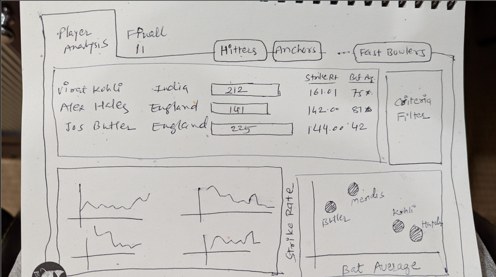
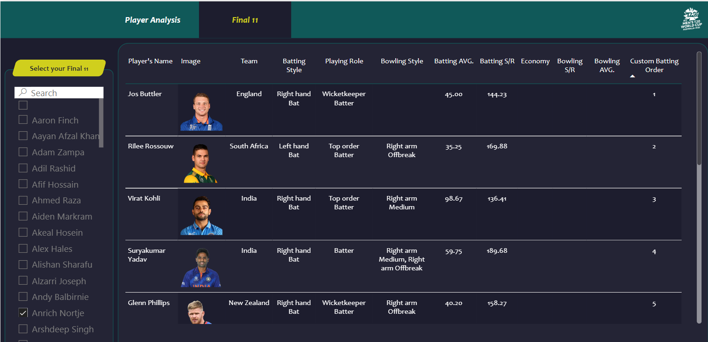
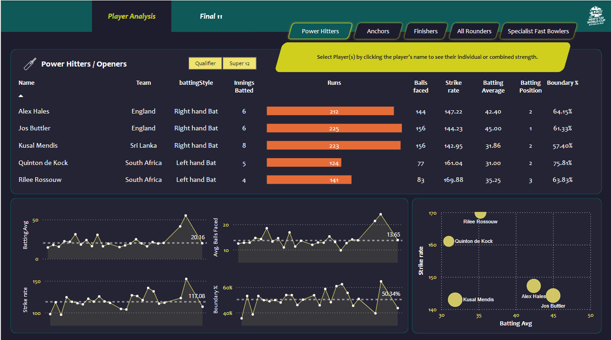

# Cricket Data Analytics: Best 11 Players Selection

## Project Overview
This project utilizes data from the T20 World Cup to identify the best 11 cricket players. The project involves data scraping from ESPNcricinfo, data cleaning and transformation using Pandas, and creating interactive dashboards in Power BI to make data-driven decisions.

## Project Structure
The repository is structured as follows:

- `data/`
  - Contains raw and processed data files.
- `scripts/`
  - Includes all the Python scripts for data scraping, cleaning, and transformation.
- `notebooks/`
  - Jupyter notebooks used for data analysis and transformation.
- `dashboards/`
  - Power BI files for interactive data visualization.

## Getting Started

### Prerequisites
- Python 3.x
- Pandas
- Jupyter Notebook
- Power BI Desktop
- Bright Data account (for web scraping)

### Installation
1. Clone the repository:
    ```bash
    git clone https://github.com/Hridxyz/T20CricketAnalysis.git
    cd T20CricketAnalysis
    ```

2. Install the required Python packages:
    ```bash
    pip install pandas jupyter
    ```

3. Set up your Bright Data account and download the necessary web scraping scripts.

## Detailed Project Process

### Step 1: Project Initiation
We started the project with a clear goal in mind: to use data from the T20 World Cup to identify the best 11 cricket players. The project began with a brainstorming session where we defined the scope, outlined the key metrics, and identified the necessary tools and technologies.

### Step 2: Data Collection
The first technical step was data collection. We used [Bright Data](https://brightdata.com/) to scrape match results, scorecards, and player information from ESPNcricinfo. This involved:
- Setting up a Bright Data account.
- Writing JavaScript scripts for web scraping.
- Extracting detailed match results tables, batting and bowling scorecards, and player-specific information.

#### Files:
- `scripts/scrape_data.js`

### Step 3: Data Cleaning and Transformation
Once the data was collected, we moved on to cleaning and transforming it. Using Python and Pandas, we performed the following tasks:
- Loaded the raw data into Jupyter Notebooks.
- Cleaned the data by handling missing values, removing duplicates, and standardizing formats.
- Transformed the data into a structured format suitable for analysis, creating new calculated columns as needed.

#### Files:
- `notebooks/t20_data_preprocessing.ipynb`

### Step 4: Data Analysis and Feature Engineering
With the cleaned data, we performed exploratory data analysis to understand key trends and metrics. We focused on:
- Calculating important cricket statistics such as batting average, strike rate, and economy rate.
- Creating DAX measures and calculated columns for deeper insights.

#### Files:
- `DAX Measures and Calculated columns.xlsx`

### Step 5: Dashboard Design and Implementation
The next step was to visualize the data using Power BI. We designed interactive dashboards to help stakeholders easily filter and view player statistics. The dashboards included:
- Player Analysis Dashboard
  
- Final 11 Players Dashboard
  

We followed these steps:
1. Imported the cleaned data into Power BI.
2. Created visualizations such as bar charts, line charts, and scatter plots to represent player performance.
3. Added interactive filters to allow users to customize the view based on different criteria.
4. Iteratively refined the dashboards based on feedback.

#### Files:
- `dashboards/Codebasics Cricket Best 11.pbix`

### Step 6: Validation and Refinement
We validated our analysis and dashboards by cross-checking with known performance statistics and incorporating feedback from stakeholders. This involved:
- Comparing our selected players with expert opinions.
- Ensuring the accuracy and relevance of the data visualizations.
- Making necessary adjustments to the dashboards and calculations.

### Step 7: Presentation and Documentation
Finally, we documented the entire process and prepared a detailed presentation for stakeholders. The documentation included:
- A comprehensive README file (this document).
- Jupyter Notebooks and Python scripts used for data processing.
- Power BI files with the final dashboards.

## Key Features
- **Data Scraping:** Extract match results, scorecards, and player information from ESPNcricinfo.
- **Data Cleaning & Transformation:** Utilize Python and Pandas for data processing.
- **Interactive Dashboards:** Create insightful visualizations in Power BI to assist in selecting the top 11 players.

## Dashboard Screenshots
### Player Analysis Dashboard


### Mockup Design


### Final 11 Players


## Skills Demonstrated
- Web Scraping
- Data Cleaning
- Data Transformation
- Data Visualization
- Sports Data Analysis
- Dashboard Design

## Contributing
Contributions are welcome! Please open an issue or submit a pull request for any changes or improvements.

## License
This project is licensed under the MIT License. See the `LICENSE` file for details.

## Contact
For any questions or inquiries, please contact:
- Hriday Bhagtani - [Email](mailto:hridayparas@gmail.com)
- Anushka Sharma - [Email](mailto:anushka.sharma7675@gmail.com)

---
*Cricket analytics project using T20 World Cup data for selecting the best 11 players via Power BI.*
